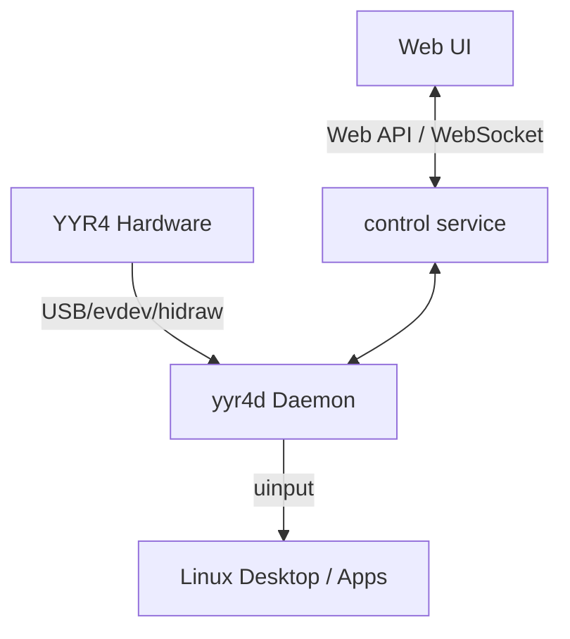

# System Architecture

## Terminology
* `YYR4`: The programmable hardware keypad.
* `yyr4-linux-control`: The project name.
* `yyr4d`: The privileged background daemon.
* `Web UI`: The browser-based frontend configuration tool.
* `Web API` / `WebSocket`: Interfaces exposed by the `control service`.
* `Profile`: A collection of Layers tied to an application context.
* `Layer`: A specific mapping of keys/encoders to Actions.
* `Action`: A discrete task (e.g., emitting a keystroke, running a command).
* `Macro` / `Workflow`: A sequence of Actions and logic.
* `Vibe Coding Approval Console`: The sub-system managing AI agent interactions.
* `CLI Adapter`: Tool-specific mappings for the Approval Console.
* `uinput` / `evdev` / `EVIOCGRAB`: Linux kernel subsystems for input management.

## Component Overview

## Process and Permission Boundaries
1. **yyr4d (Daemon)**: Runs with sufficient privileges to use `EVIOCGRAB` on the YYR4's `evdev` nodes and write to `/dev/uinput`. The daemon operates strictly in userspace. Note: We are currently in Milestone 1.3A, preparing a read-only validation tool. The full daemon and uinput generation are not yet implemented.
2. **control service**: Exposes the local Web API (`127.0.0.1` only). It must safely proxy configurations to `yyr4d`.
3. **Web UI**: Runs in the browser unprivileged.

## Data Flow
1. **device discovery**: `yyr4d` finds the YYR4 using stable udev properties.
2. **event capture**: `yyr4d` reads raw events and claims them via `EVIOCGRAB`.
3. **event normalization**: Translates raw evdev packets into abstract events (e.g., `button.k01.down`).
4. **Context Engine**: Monitors active windows (e.g., `WM_CLASS`) and loads the corresponding Profile.
5. **Vibe Coding CLI Adapter**: Intercepts if an AI CLI is active to provide Approval Layer overlays.
6. **Action Engine**: Executes the resulting Action or Macro.
7. **Output**: Synthesized through `uinput` or executed via safe subprocess.

## Fault Recovery & Extensions
* Hotplug disconnections cause graceful release of `EVIOCGRAB`.
* Invalid Profile loads rollback to the previous valid transaction.
* Wayland support is planned via an extensible Desktop Adapter model, decoupling the Context Engine from pure X11 tools.

*See also: [Web UI](web-ui.md), [Security Model](security.md).*

### M1.3B-2C Discovery Permission Separation
* Device discovery purely evaluates udev metadata to establish device identity.
* Identity selection logic does not depend on the executing user’s `os.access`.
* The `FilesystemIdentityPermissionChecker` acts as the exclusive authority for node readability and executes strictly after device grouping is complete.
