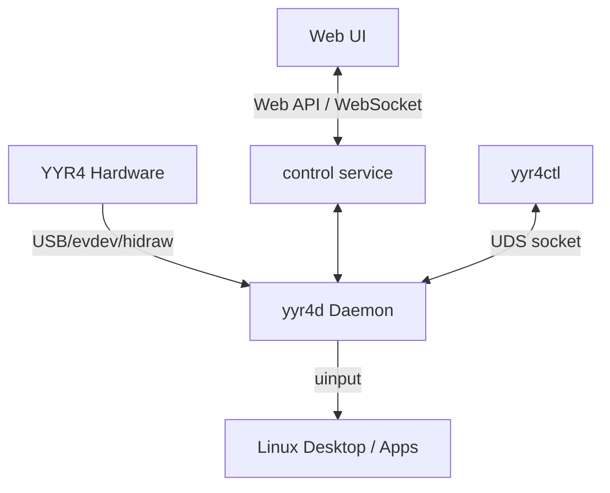

# System Architecture

## Terminology
* `YYR4`: The programmable hardware keypad.
* `yyr4-linux-control`: The project name.
* `yyr4d`: The privileged background daemon.
* `Web UI`: The browser-based frontend configuration tool (planned).
* `yyr4ctl`: The official Management CLI for inspecting and controlling the daemon.
* `Web API` / `WebSocket`: Interfaces exposed by the `control service` (planned).
* `Profile`: A collection of Layers tied to an application context.
* `Layer`: A specific mapping of keys/encoders to Actions.
* `Action`: A discrete task (e.g., emitting a keystroke, running a command).
* `Macro` / `Workflow`: A sequence of Actions and logic.
* `Vibe Coding Approval Console`: The sub-system managing AI agent interactions.
* `CLI Adapter`: Tool-specific mappings for the Approval Console.
* `uinput` / `evdev` / `EVIOCGRAB`: Linux kernel subsystems for input management.

## Component Overview

## Process and Permission Boundaries
1. **yyr4d (Daemon)**: Runs with sufficient privileges to use `EVIOCGRAB` on the YYR4's `evdev` nodes and write to `/dev/uinput`. The daemon operates strictly in userspace. Exposes a Unix Domain Socket for local management.
2. **yyr4ctl (Management CLI)**: Communicates securely with the daemon via Unix Domain Sockets (`$XDG_RUNTIME_DIR/yyr4d.sock`), verifying identical User ID (SO_PEERCRED).
3. **control service**: Exposes the local Web API (`127.0.0.1` only). It must safely proxy configurations to `yyr4d`.
3. **Web UI**: Runs in the browser unprivileged.

## Target Architecture Data Flow
1. **Device Discovery**: `yyr4d` finds the YYR4 using stable udev properties.
2. **YYR4 Identity**: Input adapter reads and normalizes raw events.
3. **Transport Parser**: Converts transmission sequences to Control semantics.
4. **Official Control Event**: Maps cleanly using official naming.
5. **ActionResolver**: Maps `OfficialControlEvent` instances against a loaded user profile (`.toml`) to produce an `ActionPlan`.
6. **ActionExecutionEngine**: Consumes `ActionPlan`, dispatches individual action steps to designated backends (e.g. `CommandRunner`, `DesktopInputBackend`), manages timeouts and cancellation, and halts sequences cleanly upon errors.
7. **Daemon Runtime**: Coordinates lifecycle and configuration loading.
8. **Management CLI (`yyr4ctl`)**: Presentation and configuration inspection tool (no direct hardware access). Coordinates via the daemon runtime UDS socket.

## Fault Recovery & Extensions
* Hotplug disconnections cause graceful release of `EVIOCGRAB`.
* Invalid Profile loads rollback to the previous valid transaction.
* Wayland support is planned via an extensible Desktop Adapter model, decoupling the Context Engine from pure X11 tools.

*See also: [Web UI](web-ui.md), [Security Model](security.md).*

## Layered Responsibilities

### Device layer
只负责发现、身份和设备接口。

### Input layer
只负责读取和归一化原始事件。

### Transport layer
只负责把传输序列转换为控件语义。

### Control domain layer
只使用官方名称。

### Configuration layer
把Control映射为Action定义。

### Action planning layer
生成确定、可测试、无副作用的ActionPlan。

### Execution layer
执行动作并隔离系统副作用。

### Runtime layer
负责daemon生命周期、重连、热加载和日志。

### Presentation layer
管理命令行 (`yyr4ctl`) 和 GUI (规划中)，不直接访问硬件，通过 UDS 通信。

同时明确：
- Probe是诊断工具，不是主运行时；
- validation ledger是验证决策来源，不是产品执行层；
- udev属于部署层；
- GUI不得直接承担设备访问。
